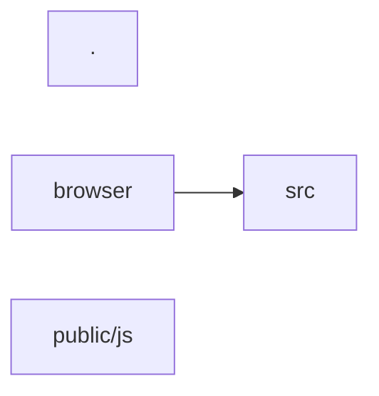

# Codebase Map diagram

Generated by the Factory from the code, so don't edit it. The Factory proposes an update in a PR after each merge.

```mermaid
flowchart LR
  m0["."]
  m1["browser"]
  m2["public/js"]
  m3["src"]
  m1 --> m3
```
